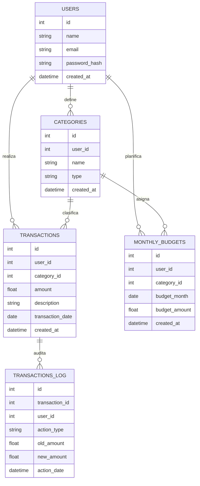

# Monthly Budget App

## 📑 Índice
- [Introducción](#introducción)
- [Objetivos](#objetivos)
- [Descripción de la Base de Datos](#descripción-de-la-base-de-datos)
- [Listado de Tablas](#listado-de-tablas-y-descripción)
  - [Tabla `users`](#1-users--usuarios)
  - [Tabla `categories`](#2-categories--categorías)
  - [Tabla `transactions`](#3-transactions--transacciones)
  - [Tabla `monthly_budgets`](#4-monthly-budgets--presupuestos-mensuales)
  - [Tabla `transactions_log`](#5-transactions_log--bitácora-de-transacciones)
- [Abreviaturas de Nombres de Campos](#abreviaturas-de-nombres-de-campos)
- [Tipos de Claves](#tipos-de-claves)
- [Vistas](#vistas)
- [Funciones](#funciones)
- [Stored Procedures](#stored-procedures)
- [Triggers](#triggers)
- [Diagrama ER](#diagrama-er)

---

## Introducción
Monthly Budget App es una aplicación para gestionar presupuestos mensuales personales o multiusuario.  
Permite registrar usuarios, definir categorías de ingresos y gastos, gestionar transacciones y establecer presupuestos mensuales por categoría.  
Está diseñada para facilitar el seguimiento financiero y la planificación mensual.

## Objetivos
- Permitir a los usuarios registrar y categorizar sus ingresos y gastos.  
- Facilitar el control y seguimiento de presupuestos mensuales por categoría.  
- Proveer vistas y consultas para análisis financiero detallado.  
- Soportar múltiples usuarios con datos separados y seguros.

## Descripción de la Base de Datos
La base de datos llamada `monthly-budget-app` está diseñada para almacenar información relacionada con usuarios, categorías, transacciones y presupuestos mensuales.  
Incluye relaciones claras entre tablas con claves primarias, foráneas e índices para optimizar consultas y garantizar integridad.

---

## Listado de Tablas y Descripción

### 1. `users` — Usuarios
Tabla que almacena los usuarios registrados en la aplicación.

| Campo          | Nombre Completo      | Tipo de Dato      | Descripción                      | Clave            |
|----------------|---------------------|-------------------|---------------------------------|------------------|
| id             | Identificador        | INT UNSIGNED      | Clave primaria auto incremental | PRIMARY KEY      |
| name           | Nombre              | VARCHAR(100)      | Nombre del usuario               |                  |
| email          | Correo Electrónico  | VARCHAR(150)      | Correo único                    | UNIQUE INDEX     |
| password_hash  | Hash Contraseña     | VARCHAR(255)      | Contraseña hasheada             |                  |
| created_at     | Fecha Creación      | TIMESTAMP         | Fecha de registro               |                  |

---

### 2. `categories` — Categorías
Tabla que contiene las categorías de ingresos o gastos definidas por cada usuario.

| Campo          | Nombre Completo          | Tipo de Dato      | Descripción                           | Clave                   |
|----------------|-------------------------|-------------------|-------------------------------------|-------------------------|
| id             | Identificador            | INT UNSIGNED      | Clave primaria auto incremental     | PRIMARY KEY             |
| user_id        | ID Usuario               | INT UNSIGNED      | Clave foránea hacia `users.id`      | FOREIGN KEY             |
| name           | Nombre Categoría         | VARCHAR(100)      | Nombre de la categoría               |                         |
| type           | Tipo                     | ENUM              | 'income' o 'expense'                 |                         |
| created_at     | Fecha Creación           | TIMESTAMP         | Fecha de creación                   |                         |

---

### 3. `transactions` — Transacciones
Registro de cada ingreso o gasto realizado por un usuario, con fecha y categoría.

| Campo          | Nombre Completo          | Tipo de Dato      | Descripción                           | Clave                   |
|----------------|-------------------------|-------------------|-------------------------------------|-------------------------|
| id             | Identificador            | INT UNSIGNED      | Clave primaria auto incremental     | PRIMARY KEY             |
| user_id        | ID Usuario               | INT UNSIGNED      | Clave foránea hacia `users.id`      | FOREIGN KEY             |
| category_id    | ID Categoría             | INT UNSIGNED      | Clave foránea hacia `categories.id` | FOREIGN KEY             |
| amount         | Monto                    | DECIMAL(10,2)     | Cantidad de la transacción          |                         |
| description    | Descripción              | VARCHAR(255)      | Texto descriptivo opcional           |                         |
| transaction_date | Fecha Transacción       | DATE              | Fecha en que se realizó              |                         |
| created_at     | Fecha Creación           | TIMESTAMP         | Fecha de registro                   |                         |

---

### 4. `monthly_budgets` — Presupuestos Mensuales
Presupuesto asignado a cada usuario para una categoría específica en un mes dado.

| Campo          | Nombre Completo          | Tipo de Dato      | Descripción                           | Clave                   |
|----------------|-------------------------|-------------------|-------------------------------------|-------------------------|
| id             | Identificador            | INT UNSIGNED      | Clave primaria auto incremental     | PRIMARY KEY             |
| user_id        | ID Usuario               | INT UNSIGNED      | Clave foránea hacia `users.id`      | FOREIGN KEY             |
| category_id    | ID Categoría             | INT UNSIGNED      | Clave foránea hacia `categories.id` | FOREIGN KEY             |
| budget_month   | Mes de Presupuesto       | DATE              | Fecha representando el mes (día=1)  |                         |
| budget_amount  | Monto Presupuestado      | DECIMAL(10,2)     | Cantidad presupuestada              |                         |
| created_at     | Fecha Creación           | TIMESTAMP         | Fecha de registro                   |                         |

---

### 5. `transactions_log` — Bitácora de Transacciones
Tabla de auditoría que registra todas las operaciones realizadas sobre la tabla `transactions` (insert, update, delete).

| Campo         | Nombre Completo         | Tipo de Dato      | Descripción                                         | Clave         |
|---------------|------------------------|-------------------|-----------------------------------------------------|---------------|
| id            | Identificador          | INT AUTO_INCREMENT| Clave primaria auto incremental                     | PRIMARY KEY   |
| transaction_id| ID Transacción         | INT               | Identificador de la transacción afectada            |               |
| user_id       | ID Usuario             | INT               | Identificador del usuario que realizó la acción      |               |
| action_type   | Tipo de Acción         | ENUM              | Tipo de acción: 'INSERT', 'UPDATE', 'DELETE'        |               |
| old_amount    | Monto Anterior         | DECIMAL(10,2)     | Valor anterior del monto (si aplica)                |               |
| new_amount    | Monto Nuevo            | DECIMAL(10,2)     | Valor nuevo del monto (si aplica)                   |               |
| action_date   | Fecha de Acción        | TIMESTAMP         | Fecha y hora en que se realizó la acción            |               |

---

## Abreviaturas de Nombres de Campos

| Abreviatura   | Nombre Completo            |
|---------------|---------------------------|
| id            | Identificador             |
| user_id       | Identificador de Usuario  |
| category_id   | Identificador de Categoría|
| name          | Nombre                    |
| type          | Tipo                      |
| amount        | Monto                     |
| description   | Descripción               |
| created_at    | Fecha de Creación         |
| transaction_date | Fecha de Transacción    |
| budget_month  | Mes de Presupuesto        |
| budget_amount | Monto Presupuestado       |

---

## Tipos de Claves

| Tipo de Clave  | Descripción                                                      |
|----------------|------------------------------------------------------------------|
| PRIMARY KEY    | Identificador único de cada registro                             |
| FOREIGN KEY    | Relación con otra tabla para mantener integridad referencial     |
| UNIQUE INDEX   | Restricción para que el campo sea único (ej: email)             |
| INDEX          | Índice para optimizar consultas basadas en ese campo            |

---

## Vistas

### Vista `view_monthly_balance`
Muestra el **balance mensual por usuario**, calculando ingresos, gastos y balance neto.

### Vista `view_expenses_by_category`
Muestra los **gastos totales agrupados por categoría y mes** para cada usuario.

### Vista `view_budget_vs_spent`
Compara el **presupuesto mensual vs el gasto real** de cada usuario en una categoría.

### Vista `view_latest_transactions`
Lista las **últimas transacciones registradas** con detalle de usuario y categoría.

### Vista `view_annual_summary`
Muestra un **resumen anual por usuario** con ingresos, gastos y balance.

---

## Funciones

### Función `get_monthly_balance`
Calcula el **balance neto** de un usuario en un mes específico (ingresos - gastos).

### Función `get_budget_for_category`
Devuelve el **presupuesto mensual asignado** a una categoría para un usuario.

---

## Stored Procedures

### SP `add_transaction`
Inserta una nueva transacción con todos sus datos (usuario, categoría, monto, descripción y fecha).

### SP `report_expenses_by_category`
Genera un reporte de los **gastos totales agrupados por categoría** en un mes específico.

---

## Triggers

### Trigger `trg_transactions_insert`
Se ejecuta después de un `INSERT` en `transactions`. Inserta un registro en `transactions_log` con el monto nuevo.

### Trigger `trg_transactions_update`
Se ejecuta después de un `UPDATE` en `transactions`. Inserta en `transactions_log` el monto anterior (`OLD.amount`) y el nuevo (`NEW.amount`).

### Trigger `trg_transactions_delete`
Se ejecuta después de un `DELETE` en `transactions`. Inserta en `transactions_log` el monto eliminado (`OLD.amount`).

> 📌 La tabla `transactions_log` funciona como auditoría, registrando todas las operaciones (insert, update, delete) para trazabilidad completa.

---

## Diagrama ER

